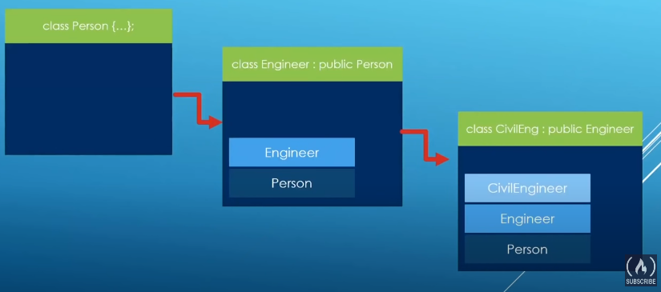

### Inheritance

- A defining feature of object oriented programming in C++ building types on top of other types.
- Building types on top of other types.
- Inheritance hierachies can be set up to suit your needs.
- Code reuse is improved.