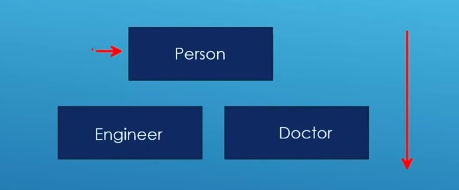
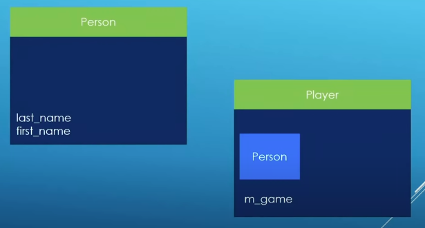

### Your first try on inheritance

Example1:

Example2:

this model

Base model:

	class Person{
		// stream output operator to print out instance out of the console
		friend std::ostream& operator << (std::ostream& out, const Person& person);
		public:
			Person();
			Person(std::string first_name_param,std::string last_name_param);
			~Person();
		private:
			std::string first_name{"Mysterious"};
			std::string last_name{"Person"};
	}

Inheriate model

	//#include "person.h"
	class Person; // Forward declaration
	class Player: public Person
	{
		friend std::ostream& operator << (std::ostream& out, const Player& player);
		public:
			Player() = default;
			Player(std::string game_param);
			~Player();
		private:
			std::string m_game("None");
		};

- With public inheritance, derived classes can access and use public members of the base class, but the derived class can not directly access private members

- The same also applies to friends of derived class. They have access to private members of derived but don't have access to the base class

[github-source code](https://github.com/rutura/The-C-20-Masterclass-Source-Code/tree/main/36.Inheritance)

s noted in cppreference.com, std::string_view is only available in c++17 or newer.

In order to use it, enable it in your compiler. For g++ or clang++, use the switch -std=c++17

As noted in cppreference.com, `std::string_view` is only available in c++17 or newer.

In order to use it, enable it in your compiler. For g++ or clang++, use the switch `-std=c++17`