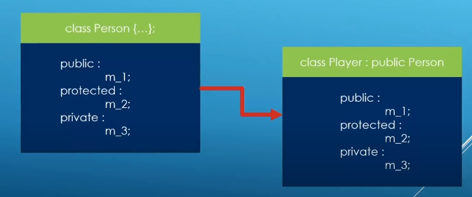
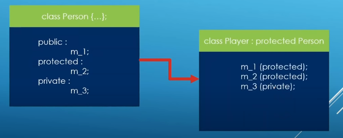
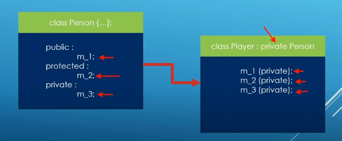
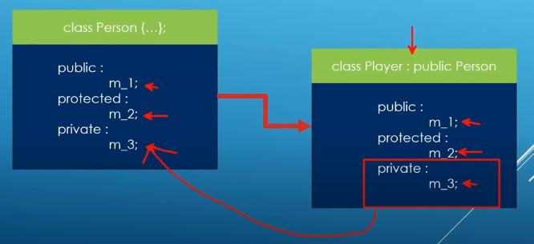

### Base class access specifiers: Zooming in

Protected inherintance class `class Player: protected Person`

Privated inheritance class `class Player: protected Person`

Through the base class access specifier, we can control how relaxed od constained is the access of base class members from the derived class.

Regardless of the access specifier, private members of base class are never accessible from derived classes.

Anything private from base class will be private from derive class meaning can be access from the inside or outside
