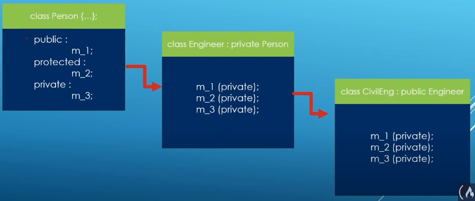

### Closing in on Private Inheritance

private in base class will be unaccessable from private derive class.

private from base class will be accessable from the public derive class.

Base model

	class Person
	{
		friend std::ostream& operator<<(std::ostream&, const Person& person);
		public:
			Person() = default;
			Person(const std::string& fullname, int age, const std::string address);
			~Person();
		public:
			std::string_m_full_name{"None"};
		protected:
			int m_age {0};
		private:
			std::string m_address{"None"};
	};

Derived model `Engineer`

	class Person; // Forward declaration
	class Engineer : private Person
	{
		friend std::ostream& operator<<(std::ostream& out, const Engineer& operand);
		public:
			Engineer();
			~Engineer();
			void build_something(){

			}
		protected:
			int contract_count{0};
	};

Derived of derived model `CivilEngineer`

	class Engineer;
	class Civil Engineer : public Engineer{
		friend std::ostream& operator<<(std::ostream&, const CivilEngineer& operand);
	public:
		CivilEngineer();
		~CivilEngineer();
		void build_road(){

		}
	private:
		std::string m_speciality("None");
	};