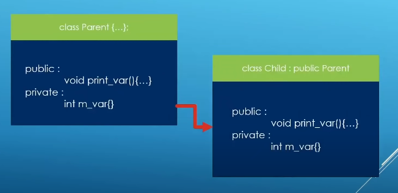

### Reused Symbols in Inheritance

The child class can be function or variable with the same name as parent child. If you use member in the parent class it will act like the member in the parent class. If you call the name in the child class it will act like the member in child class.

The member have the same name with parent class will overwrite the member in parent class.

Example:

parent class

	#ifndef PARENT_H
	#define PARENT_H
	#include <iostream>
	class Parent {
	public:
		Parent() = default;
		Parent(int member_var) : m_member_var(member_var){}
		~Parent() = default;
		void print_var() const{
			std::cout << "The value in parent is: " << m_member_var << std::endl;
		}
	protected:
		int m_member_var{100};
	};
	#endif

child class

	#ifndef CHILD_H
	#define CHILD_H
	#include "parent.h"
	class Child : public Parent {
	public:
		Child() = default;
		Child(int member_var) : m_member_var(member_var){}
		~Child() = default;
		void print_var() const{
			std::cout << "The value in child is: " << m_member_var << std::endl;
		}
		void show_values() const{
			std::cout << "The value in child is: " << m_member_var << std::endl; // The value in parent must be in accessible scope from the derived class.
			std::cout << "The value in parent is: " << Parent::m_member_var << std::endl;
		}
	private:
		int m_member_var{1000};
	};
	#endif