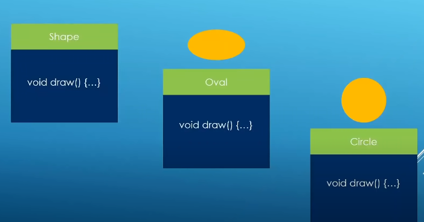
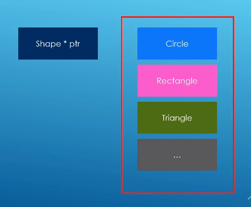
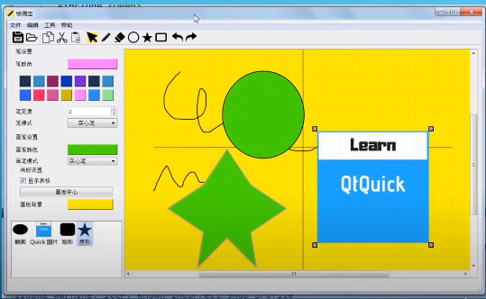

### Polymorphism

Polymorphism: a base pointer or reference managing derived class objects

Pointer:

	Shape * shape1 = new Circle;
	Shape * shape2 = new Rectangle;
	Shape * shape3 = new Oval;

Reference:

	Shape& ref1 {&shape1};
	Shape& ref2 {&shape2};
	Shape& ref3 {&shape3};
	// Release the memory

Passing base pointers or references to functions

Pointer

	void draw_shape(Shape* shape_ptr){
		shape_ptr -> draw(); //Calls the right method for the kind of object passed in
	}

Reference

	void draw_shape(const Shape& shape){
		shape -> draw(); // Calls the right method for the kind of object passed in
	}

Storing base pointers in a collection like array

	Circle circle1(7.2,"circle1");
	Oval oval1(13.3,1.2,"Oval1");
	Circle circle2(11.2,"circle2");
	Oval oval2(31.3,15.2,"Oval2");
	Circle circle3(12.2,"circle3");
	Oval oval3(53.3,9.2,"Oval3");

	Shape* shape3[] {&circle1,&oval1,&circle2,&oval2,&circle3,&oval3};
	
	for (Shape* shape_ptr : shapes3){
		std::cout << "Inside array,sizeof(*shape_ptr): " << sizeof(*shape_ptr) << std::endl;
		shape_ptr->draw();
		std::cout << std::endl;
	}

Managing derived objects in memory though base pointers or references and getting the right method called on the base pointer

