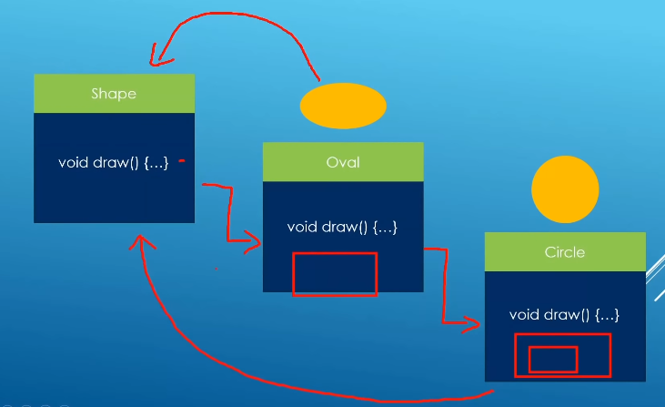

### Static Binding with Inheritance

If we have a lot of shape in our program, we have to define a lot function. More functions as you deal with more shape types. 30? 70? 100? It is messy. Example:

	void draw_circle(const Circle& circle){
		circle.draw();
	}
	void draw_oval(const Oval& oval){
		oval.draw();
	}

If you have a collection, you can use a single collection and a same method instead multi collections.Example

	std::cout << std::endl;
	std::cout << "Shapes stored in collection" << std::endl;
	Circle circle_collection[]{circle1,Circle(10.0,"Circle2"),Circle(20.0,"Circle3")};
	Oval oval_collection[]{oval1,Oval(22.3,51.1,"Oval2"),Oval(10.0,20.0,"Oval3")};

	for (const auto& c: circle_collection){
		c.draw();
	}

	for (const auto& o: oval_collection){
		o.draw();
	}

What we really:

	Shape shape1("shape1");
	Oval oval1(2.0,3.5,"Oval1");
	Circle circle1(3.3,"Circle1");
	Shape* shape_collection[]{&shape1,&oval1,&circle1};

	for (Shape* s_ptr: shape_collection){
		s_ptr->draw();
	}

Static binding with base class pointer

	Shape shape1("shape1");
	Oval oval1(2.0,3.5,"Oval1");
	Circle circle1(3.3,"Circle1");

	std::cout << std::endl;
	std::cout << "Calling methods through pointers: static binding" << std::endl;

	Shape* shape_ptr = &shape1;
	shape_ptr->draw(); // We would wish for Shape::draw() to be called

	shape_ptr = &oval1;
	shape_ptr->draw(); // We would wish for Oval::draw() to be called

	shape_ptr = &circle1;
	shape_ptr->draw(); // We would wish for Circle::draw() to be called

The compiler just looks at the pointer type to decide with `draw()` version to call. It sees `Shape*` and calls `Shape::draw()`. This is static binding in action.

Static bindind with base class reference

	Shape shape1("shape1");
	Oval oval1(2.0,3.5,"Oval1");
	Circle circle1(3.3,"Circle1");
	std::cout << std::endl;
	std::cout << "Calling methods through references: static binding" << std::endl;
	Shape& shape_ref = shape1;
	shape_ref.draw();
	Shape& shape_ref1 = oval1;
	shape_ref1.draw();
	Shape& shape_ref2 = circle1;
	shape_ref2.draw();

The compiler just looks at the reference type to decide with `draw()` verison to call. It sees `Shape&` and calls `Shape::draw()`.This is static binding in action!