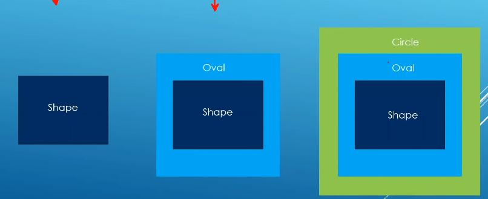
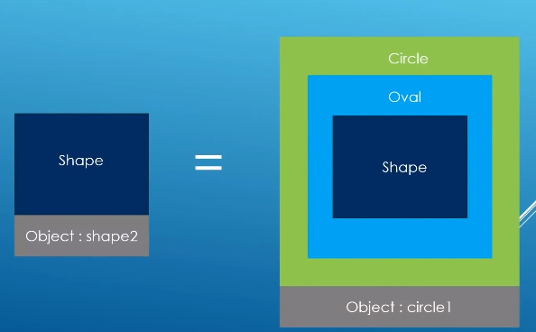
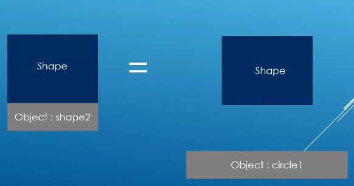

### Size of polymorphic objects and slicing

Shape

	//Comparing object sizes
	std::cout << "sizeof(Shape): " << sizeof(Shape) << std::endl;
	std::cout << "sizeof(Oval): " << sizeof(Oval) << std::endl;
	std::cout << "sizeof(Circle): " << sizeof(Circle) << std::endl;

If you use `virtual` your object is going bigger

Sicling

	Shape shape1("Shape1");
	Oval oval1(2.0,3.5,"Oval1");
	Circle circle1(3.3,"Circle1");

	Shape shape2 = circle1; // Strip off Oval and circle

