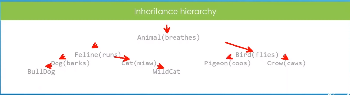

### Final

- Restrict how you override methods in derived classes

- Restrict how you can derive from a base class

If you don't want the derived class overide the `virtual menthod` you can use `final`

		class Dog : public Feline{
		public:	
			Dog() = default;
			Dog(std::string_view fur_style, std::string_view description);
			virtual ~Dog();
			virtual void bark() const{
				std::cout << "Dog::bark called: Woof!" << std::endl;
			}
			virtual void breathe() const override{
				std::cout << "Dog::breathe called for: " << m_description << std::endl;
			}
			// The run method in subclasses of dog can not be override
			// further, derived classes are forced to use the implmentation in Dog
			virtual void run() const override final{
				std::cout << "Dog " << m_description << "is running" << std::endl;
			}
		};

Cat restricts further sub-classing downstream, Meaning if anyone trying to inheritate the class it will get the compiler error

	class Cat final : public Feline{
		public:
		Cat() = default;
		Cat(const std::string_view fur_style,const std::string_view description);
		~Cat();
		virtual void miaw() const{
			std::cout << "Cat::miaw() called for cat " << m_description << std::endl;
		}
	};

Interesting fact #1: final lone class

	class Plane final{
		Plane() = default;
	};
	//This will trigger a compiler error
	class FigherJet : public Plane{

	}

Interesting fact #2: Introduced useless virtual methods

	class Cat final : public Feline{
	public:
		Cat() = default;
		Cat(const std::string_view fur_style, const std::string& description);
		~Cat();
		//Useless virtual method, Cat is final, so no one will be deriving from
		//this class and have a chance to specialize it
		virtual void miaw() const{
			std::cout << "Cat::miaw() called for cat " << m_description << std::endl;
		}
	};

Can override in a  final class: Make sence!

	class Cat final : public Feline
	{
	public:
		Cat() = default;
		Cat(const std::string_view fur_style, const std::string_view description);
		virtual ~Dog();

		virtual void bark() const{
			std::cout << "Dog::bark called: Woof!" << std::endl;
		}

		void virtual run() const override{}
	};

Interesting face #3: Introduced virtual final method
	
	class Bird : public Animal{
	public:
		Bird() = default;
		Bird(const std::string_view wing_color, const std::string_view description);
		~Bird();
		// This is contradictory : virtual an final have counter acting effects.
		// Final wins here
		virtual void fly() const final{
			std::cout << "Bird::fly() called for bird: " << m_description << std::endl;
		}
	private:
		std::string m_wing_color;
	};