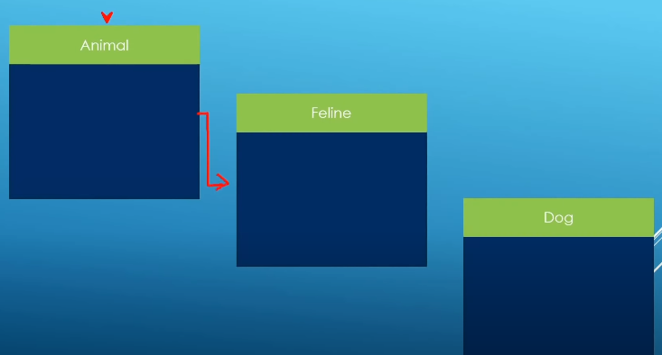

### Virtual Destructors

Destructors called in reverse

	Dog dog0("dark yellow","dog0");

BAD: Only animal destructor called

	// Through Animal pointer
	Animal *animal1 = new Dog("dark yellow","dog1");
	delete animal1;

Solution: Mark your destructors virtual, we need the destructor to be call using polymorphism.

	class Feline : public Animal{
	public:
		Feline() = default;
		Feline(const std::string_view fur_style,const std::string_view description);
		virtual ~Feline();
		virtual void run() const{
			std::cout << "Feline " << m_description << "is running" << std::endl;
		}
		std::string m_fur_style;
	};