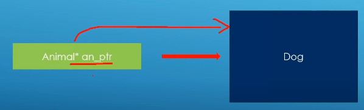

### Dynamic_cast<>()

If you have a base class pointer pointing to a derived class object,

- Transforming from base class pointer or reference to derived class pointer or reference, at run time.

- Makes it possible to call non polymorphic methods on derived objects.

Base class method:
		
		class Animal{
		public:
			Animal() = default;
			Animal(std::string_view description);
			virtual ~Animal();
			virtual void breathe() const{
				std::cout << "Animal::breathe called for: " << m_description << std::endl;
			}
		protected:
			std::string m_description;
		};
		
		#endif

Feline class method:

	class Feline : public Animal{
	public:
		Feline() = default;
		Feline(const std::string_view fur_style, const std::string_view description);
		virtual ~Feline();

		virtual void run() const{
			std::cout << "Feline " << m_description << "is running" << std::endl;
		}

		void do_some_feline_thingy(){
			std::cout << "Doing some feline thingy..." << std::endl;
		}
		std::string m_fur_style;
	};

Dog class

	class Dog : public Feline{
	public:
		Dog() = default;
		Dog(const std::string_view fur_style, const std::string_view description);
		virtual ~Dog();
		virtual void bark() const{
			std::cout << "Dog::bark called: Woof!" << std::endl;
		}
	};

Initially we have a base class pointer or reference

	//Base class pointer
	Animal* animal1 = new Feline("stripes","feline1");
	//Base class reference
	Feline feline2 ("stripes","feline2");
	Animal& animal_ref = feline2;

Casting pointers

	// If the cast succeeds, we get a valid pointer back,
	// If it fails, we get nullptr. So we can check before
	// calling stuff on the rerurned pointer

	Feline* feline_ptr = dynamic_cast<Feline*>(animal1);
	if(feline_ptr){
		feline_ptr->do_some_feline_thingy();
	}
	else{
		std::cout << "Could not cas to Feline pointer,Sorry." << std::endl;
	}

Casting references

	Feline& feline_ref {dynamic_cast<Feline&>(animal_ref)};
	feline_ref.do_some_feline_thingy();
	
	// We do not have a nullptr equivalent for references,so
	// there is no way to directly check the return value like we did
	// with pointers, But we can turn the reference into pointer and then do the cast

	Feline* feline_ptr_1 {dynamic_cast<Feline*>(&animal_ref)};
	if(feline_ptr_1){
		feline_ptr_1->do_some_feline_thingy();
	}else{
		std::cout << "Could not cast to Feline reference,Sorry." << std::endl;
	}

When casting fails

	Dog* dog_ptr = dynamic_cast<Dog*>(animal1);

	if(dog_ptr){
		dog_ptr->do_some_feline_thingy();
	}
	else{
		std::cout << "Could not cast to Feline pointer, Sorry" << std::endl;
	}

	Dog* dog_ptr_1{dynamic_cast<Dog*>(&animal_ref)};
	if (dog_ptr_1){
		dog_ptr_1->do_some_feline_thingy();
	}
	else{
		std::cout << "Could not cast to feline reference,Sorry." << std::endl;
	}

Casting usually done in functions

	void do_something_with_animal_ptr(Animal* animal){
		std::cout << "In function taking base pointer..." << std::endl;
		Feline* feline_ptr = dynamic_cast<Feline*>(animal);
		if(feline_ptr){
			feline_ptr->do_some_feline_thingy();
		}
		else{
			std::cout << "Could not cast to Feline pointer,Sorry." << std::endl;
		}
	}

	void do_something_with_animal_ref(Animal& animal){
		std::cout << "In function taking base reference..." << std::endl;
		Feline* feline_ptr_1 {dynamic_cast<Feline*>(&animal)};
		if(feline_ptr_1){
			feline_ptr_1->do_some_feline_thingy();
		}
		else{
			std::cout << "Could not cast to Feline reference,Sorry." << std::endl;
		}
	}

Overusing down casts is a sign of bad design, if you find yourself doing this a lot to call polymorphic functions on derived objects. may be you should make that dunction polymorphic in the first place.

We can not cast by derived of derived class.

*Note* Dynamic cast is only going to work with polymorphism function in inheritated class

	int data{45};

	std::string data_str = dynamic_cast<std::string>(data);