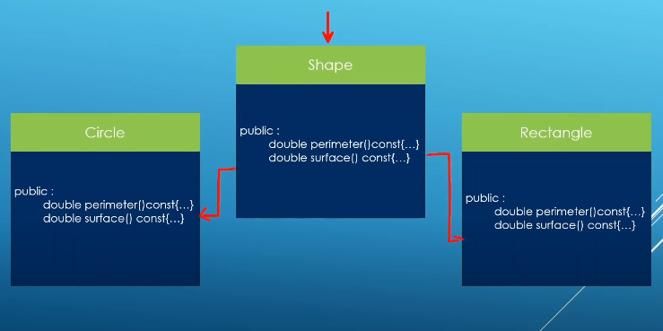

### Pure virtual functions and abstract classes

Pure virtual functions is the mechanism to mean that the method is not implemented in base class. Once you create atleast one pure virtual function, the class will be become an abstract class. and if you try to create instance by abstract class it will be error.

	Shape* shape = new Shape(); // Error : Shape is an abstract class can not create objects of it

Pure virtual functions

	class Shape{
	protected:
		Shape() = default;
		Shape(const std::string& description);
	public:
		virtual ~Shape() = default;
		//Pure virtual functions
		virtual double perimeter() const=0;
		virtual double surface() const=0;
	private:
		std::string m_description;
	}

- If a class has at least one pure virtual function, it becomes an abstract class

- You can not create objects of an abstract class, if you do that, you will get a hard compiler error

- Derrived class from an abstract class must explicitly override all the pure virtual functions from the abstract parent class, if they don'they themselves become abstract

- Pure virtual functions don't have an implementation in the abstract class. They are meant to be implemented by deriving classes.

- You can not call the pure virtual functions from the constructor of abstract class.

- The constructor of the abstract class is used by deriving class to build up the base part of the object.