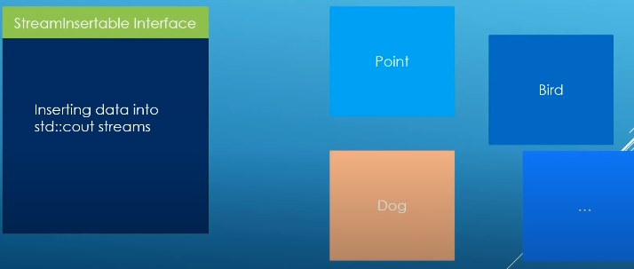

### Abstract classes as interfaces

- An abstract class with only pure virtual functions and no member variable can be used to model what is called an interface in object oriented programming.

- An interface is a specification of something that will be fullt implemented in a derived class but  the specification itself resides in the abstract class.

Stream Insertable interface

	class StreamInsertable{
		friend std::ostream& operator << (std::ostream& out, const StreamInserable& operand);

	public:
	virtual void stream_insert(std::ostream& out) const = 0;
	};

Point implements the streaminsertable interface

	class Point : public StreamInsertable{
	public:
		
		Point() = default;
		
		Point(double x ,double y) : m_x(x), m_y(y){
		}

		virtual void stream_insert(std::ostream& out) const override{
			out << "Point [x: " << m_x << ",y: " << m_y << "]";
		}

	private:
		double m_x;
		double m_y;
	};

Some translation unit

	#include "stream_insertable.h"

	std::ostream& operator << (std::ostream& out, const StreamInsertable& operand){
		operand.stream_insert(out);
		return out;
	}

Apply the virtual function side the other class

	class Bird : public Animal
	{
	public:
		
		Bird() = default;
		
		Bird(const std::string_view wing_color, const std::string_view description);

		~Bird();

		virtual void fly() const{
			std::cout << "Bird::fly() called for bird: " << m_description << std::endl;
		}

		virtual void stream_insert(std::ostream_view out) const override{
			out << "Bird [description: " << m_description << ",wing_color: " << m_wing_color << "]";
		}

	protected:
		std::string m_wing_color;
	};
