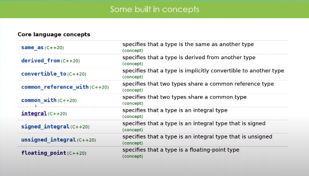

### Concepts

Concepts is a mechanism to place constraints on your template type parameters.Example an alternative to static asserts and type traits

	template <typename T>
	void print_number(T n){
		static_assert(std::is_integral<T>::value,"Must pass in an integral argument");
		std::cout << "n: " << n << std::endl;
	}

There are 2 type of concepts

- Standard builtin in concepts
- Custom concepts

### Some built in concepts

