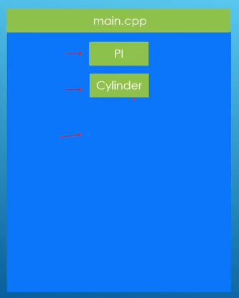
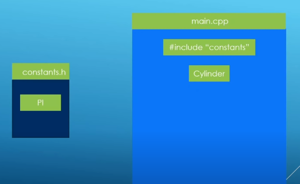
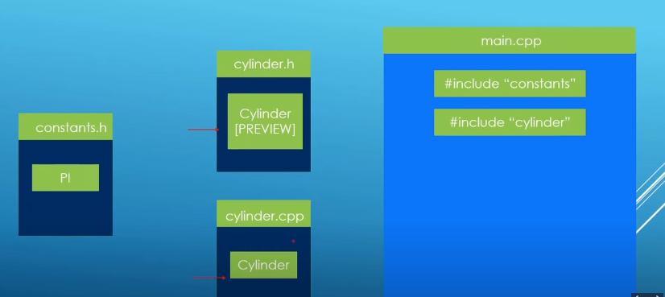

### Class across multiple files

Implementation1: Everything in main function

Implementation2: split PI constant into header file

or

Constants file:

	const double PI {3.1415};

You can avoid multi-declaration by this

	#ifndef CONSTANTS_H
	#define CONSTANTS_H
	const double PI {3.1415};
	# endif

cylinder header:

	class Cylinder {
	private:
		double base_radius;
		double height;
		double PI;
	public:
		// constructors
		Cylinder() = default;
		Cylinder(double base_param,double height_param){
			base_radius = base_param;
			height = height_param;
		}
		// Getters
		double get_base_radius(){
			return base_radius;
		}
		double get_height(){
			return height;
		}
		// Setters
		void set_base_radius(double radius_param){
			base_radius = radius_param;
		}
		void set_height(double height_param){
			height = height_param;
		}
		void set_pi(double radius_param){
			base_radius = radius_param;
		}
		double volume(){
			return base_radius * base_radius * PI * height;
		}
};

Main file:

	# include <iostream>
	# include "cylinder.h"
	# include "constants.h"
	int main(int argc,char** argv){
		double r {2};
		double h {3};
		double pi {3.1415};
		Cylinder cylinder1;
		// Setters
		cylinder1.set_base_radius(r);
		cylinder1.set_height(h);
		cylinder1.set_pi(pi);
		
		// Getters
		std::cout << "base radius: " << cylinder1.get_base_radius() << std::endl;
		std::cout << "base radius: " << cylinder1.get_base_radius() << std::endl;
		std::cout << "volume: " << cylinder1.volume() << std::endl;
		return 0;
	}

build file `g++ main.cpp` after build file, it can be run from anywhere.

Implementation3: split class and constant into 2 seperated file

Header file 

	#ifndef CYLINDER_H
	#define CYLINDER_H

	class Cylinder {
		private:
			double base_radius;
			double height;
		public:
			// constructors 
			Cylinder() = default;
			Cylinder(double base_param,double height_param);

			double volume();
			
			// Getters
			double get_base_radius();

			double get_height();
			
			// Setters
			void set_base_radius(double radius_param);

			void set_height(double height_param);
	};

	#endif

CPP file

	#ifndef CYLINDER_CPP
	#define CYLINDER_CPP

	#include "cylinder.h"
	#include "constants.h"

	// A definition of constructor Cylinder(double base_param,double height_param)
	Cylinder::Cylinder(double base_param,double height_param){
				base_radius = base_param;
				height = height_param;
			}

	double Cylinder::volume(){
		return base_radius * base_radius * PI * height;
	}

	double Cylinder::get_base_radius(){
		return base_radius;
	}
	double Cylinder::get_height(){
		return height;
	}
	// Setters
	void Cylinder::set_base_radius(double radius_param){
		base_radius = radius_param;
	}
	void Cylinder::set_height(double height_param){
		height = height_param;
	}

	#endif

You can call the name of constant or instance because the name is unique define