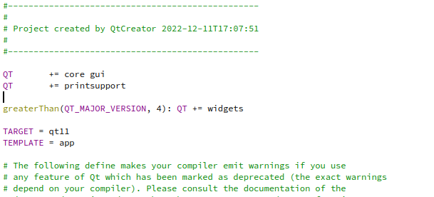
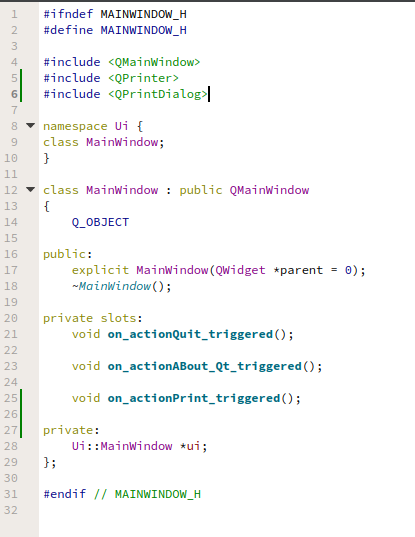
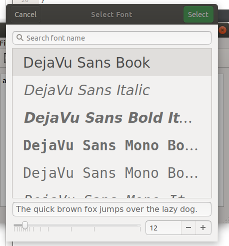

# Creating PrintDialog

add libraries

    #include <QPrinter>
    #include <QPrintDialog>

function print

print function

    void MainWindow::on_actionPrint_triggered()
    {
        QPrinter printer;
        QPrintDialog dialog(&printer,this);
        dialog.setWindowTitle("Print Document");
        if(ui->textEdit->textCursor().hasSelection()){
            dialog.addEnabledOption(QAbstractPrintDialog::PrintSelection);
        }
        if(dialog.exec() != QDialog::Accepted){
            return;
        }

    }
