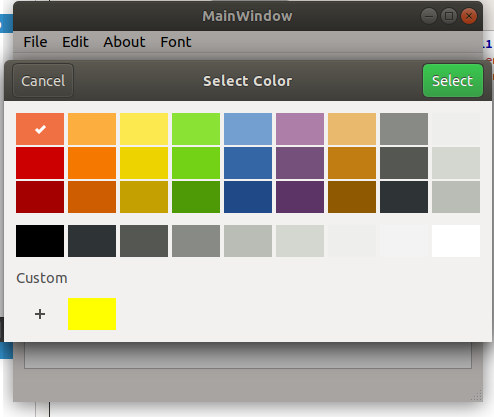

#Creating ColorDialog

function change color

    void MainWindow::on_actionColor_triggered()
    {
        bool ok;
        QColor color = QColorDialog::getColor(Qt::yellow,this);
        if (&ok){
            ui->textEdit->setTextColor(color);
        }
    }
