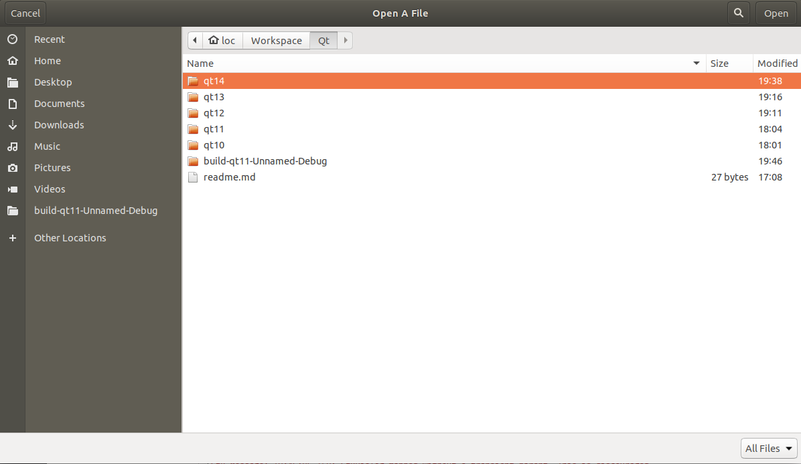

# Creating ColorDialog

function openfile dialog

    void MainWindow::on_actionOpen_triggered()
    {
        // Create file dialog
        QString filename = QFileDialog::getOpenFileName(this,"Open A File","/home/loc/Workspace/Qt/");
        ui->textEdit->setText(filename);
    }
