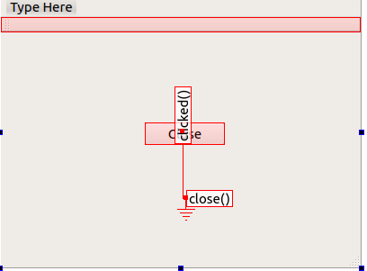

# signal and slot

`signal and slot` are the mechanism for communicate between object

in GUI window application, when we change an object we also want the other will be notify and more generally the other object can be communicate with the other, For example if the close button object pushed we also want window object to be close.

You can define the mechanism on GUI or by command code

	 // Make the connection via code
	    connect(ui->horizontalSlider,SIGNAL(valueChanged(int)),
	            ui->progressBar,SLOT(setValue(int)));

**Note**

