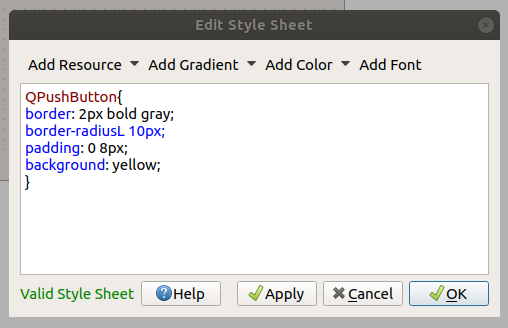
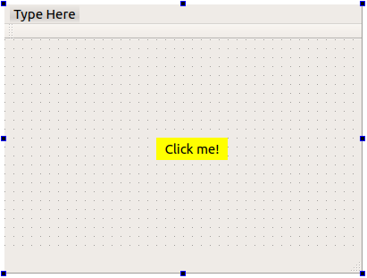
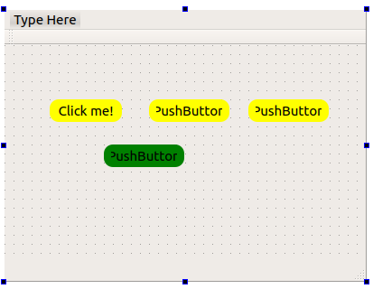
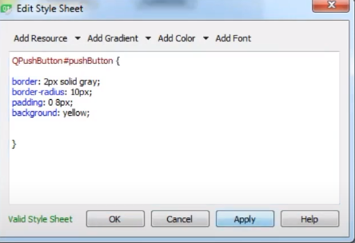
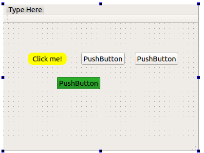
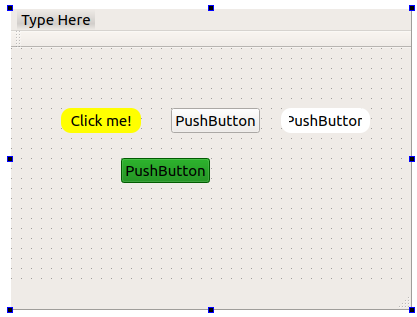

# Addiing CSS Styles

You can define style by 2 way

- in your specific object: the changing only apply on this object

- in the main screen: the changing will apply for all object

**Notes**

Only apply for this specific object but on global styleSheet

