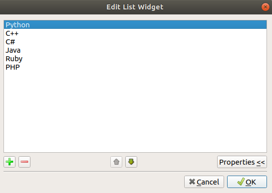

# QListWidget

You can add item in ListWidget by ui

Or you can add item ListWidget in dialog.cpp

    // QStringList is the custom list object of Qt
    QStringList Languages = {"C++","Python","C#","Java","Ruby","PHP"};
    // each item in QStringList is QString, loop over the items and add to listWidget
    foreach(QString item,Languages){
       ui->listWidget->addItem(item);
    }
